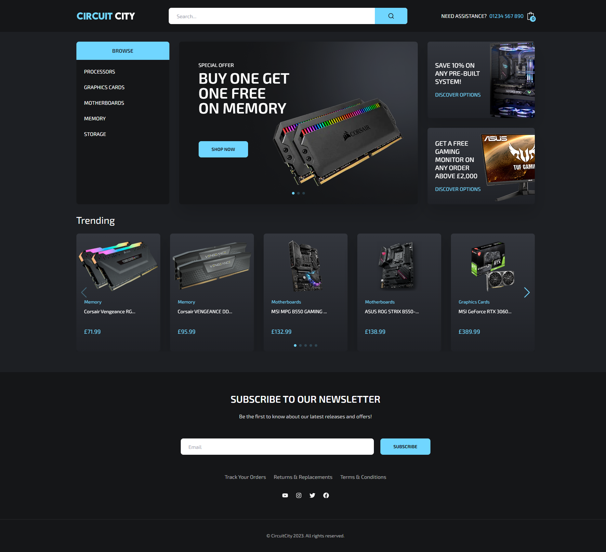
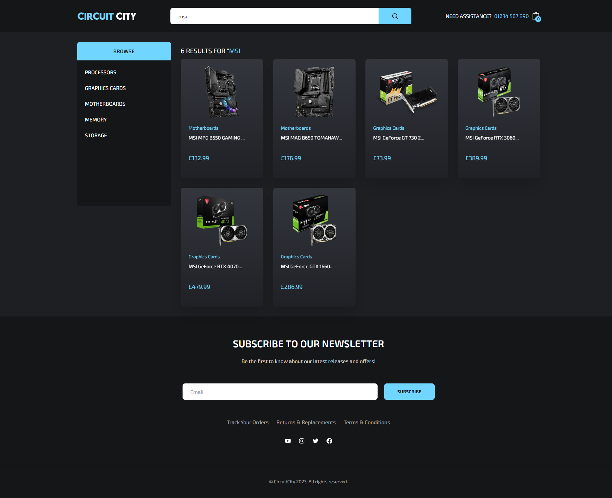
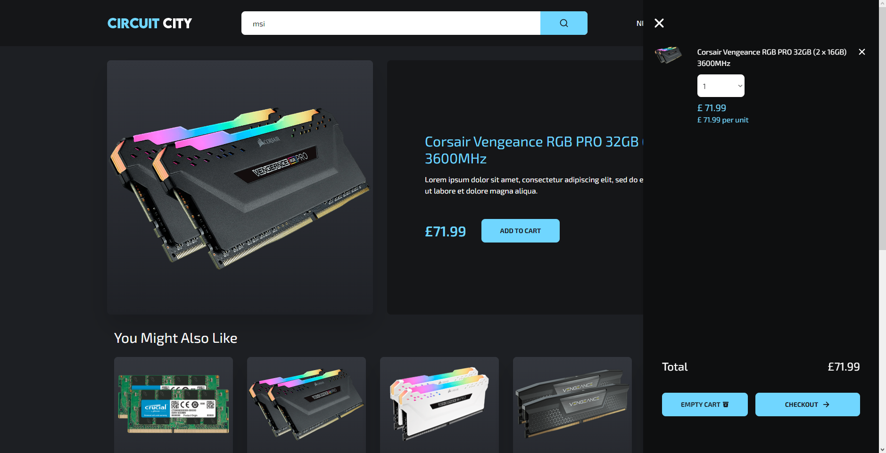

# Circuit City Ecommerce

This ecommerce website is built using React, JavaScript, Strapi, and Tailwind CSS. It offers a visually appealing interface alongside a smooth browsing experience. Strapi enables easy content management for the admins of the website, while Tailwind CSS ensures a consistent and responsive design.

## Showcase

Homepage

Category View

Search

Product View

Cart

Homepage Mobile View

